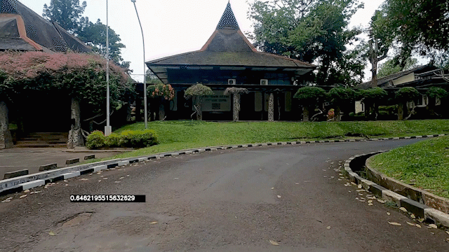
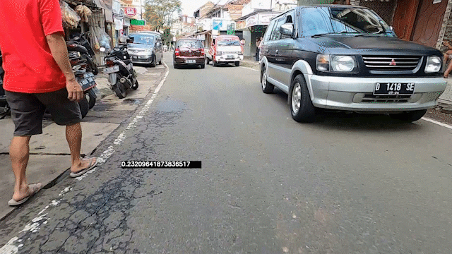
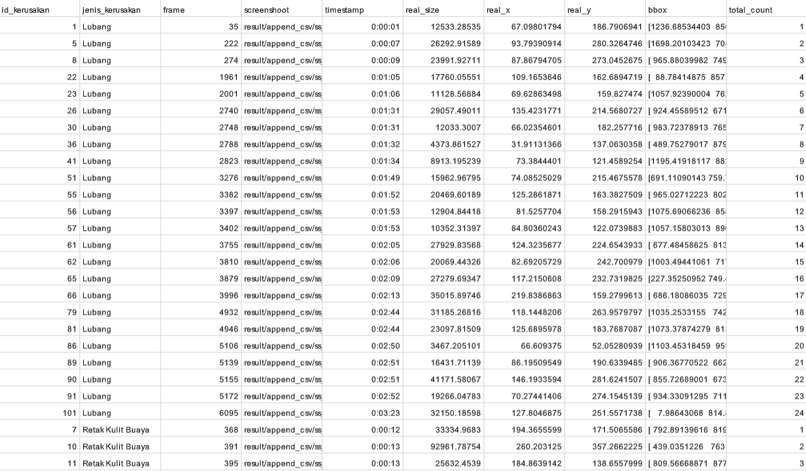

# Pipeline Road Damage Detection - Matching Fund

## Cara menjalankan
1. Setup dulu CUDA Toolkit sama CUDNN yang versinya support tensorflow-gpu versi 2.7.0  
https://www.tensorflow.org/install/source#gpu (di bagian tested build configuration)

2. Buka main.ipynb

3. jika baru pertama kali, jalanin cell paling bawah yang isinya:
```
!pip install -r requirements.txt
```
  (tensorflow-gpu yang bakal diinstall 2.7.0 jadi hati hati kedowngrade)
  
4. Jalanin cell paling atas yang isinya:
```
from pipeline_func import *
```

5. Ubah-ubah input_video dengan path video input yang diinginkan, dan ubah out_folder dengan nama folder keluaran yang diinginkan
```
print("Start") # Biar bisa keliatan progressnya (kalo dijalanin di vscode)

input_video = "input/1.mp4"
out_folder = "video_itebe"

# Definisi fungsi ada file pipeline_func.py di definisi fungsi terakhir (line 498)
road_damage_detection(input_video, out_folder)
```
6. Tunggu 👍

## Deteksi Lubang
<p align="center"></p>

## Deteksi Retak Kulit Buaya
<p align="center"></p>

## CSV Detail Kerusakan
<p align="center"></p>

# Matching Fund Alat Survey Kondisi Perkerasan Jalan - Kelompok AI

18220002 - Verawati Esteria S. Simatupang  
18220010 - Agnes Tamara Putri  
18220022 - Kofifan Hertza Haribowo  
18220028 - Muhammad Dzaki Dwi Putranto  
18220038 - Akmal Jauhar Sidqi  
18220042 - Faris Tristan Fabian  
18220054 - Salimatussholati Az Zahra  
18220066 - Michel Vito Adinugroho  
18220080 - Vito Christian Samudra  
18220082 - Sitanggang Jerry Josia Partogi  
18220088 - Ahmad Wafika Samsea  
18220100 - Hughie Raymonelika Manggala  
18220106 - Thomas Stefen Mardianto  
18220108 - Muhammad Furqan Alfuady  
